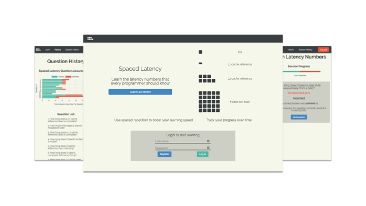

# Spaced Latency



Learn the [latency numbers every programmer should know](https://gist.github.com/hellerbarde/2843375)
using spaced-repetition.

This project is a collaboration with between [Thomas Chun](https://github.com/ThomasChun)
and [Arun Seehra](https://github.com/aseehra).

## Live version

[Demo](https://spaced-latency.herokuapp.com)

## Motivation
The [latency numbers every programer should know](https://gist.github.com/hellerbarde/2843375)
first proposed by [Peter Novig](http://norvig.com/21-days.html#answers), are incredibly useful
for back of the envelop calculations regarding scalability and system design. They are
perfectly suited for memorization using the spaced-repetition technique.

## Features
 - Learn common latency numbers via spaced-repetition
 - Visualize your progress with beautiful charts

## Future work
 - Improve per-session statistics. E.g. most missed question(s) at the end of a session
 - Allow users to reset their data
 - Unit/integration tests

## Technologies
### Frontend
 - React (create-react-app)
 - Redux
 - React Router
 - Redux Forms
 - Chart.js + react-chartjs-2

 ### [Backend](https://github.com/thinkful-ei25/spaced-repetition-server-arun-thomas)
 See [server repository for details](https://github.com/thinkful-ei25/spaced-repetition-server-arun-thomas)
 for details
 - Node.js
 - MongoDB
 - Express
 - Passport + JSON Web Tokens

## Key components
### Backend
 - [models/user.js](https://github.com/thinkful-ei25/spaced-repetition-server-arun-thomas/blob/master/models/user.js):
   Implementation of the spaced-repetition algorithm is contained in `User.shiftHead()`.
   The `User.questions` array is treated as a fixed-length singly-linked-list with the `nextQuestion`
   pointer stored on the question object. Additionally, session management is split between
   `user.js` and `routes/users.js`
 - [routes/question.js](https://github.com/thinkful-ei25/spaced-repetition-server-arun-thomas/blob/master/models/user.js):
    Responsible for serving questions to users and checking their corresponding answers.

### Frontend
 - [actions/question.js](https://github.com/thinkful-ei25/spaced-repetition-arun-thomas/blob/master/src/actions/question.js)
   and [reducers/question.js](https://github.com/thinkful-ei25/spaced-repetition-arun-thomas/blob/master/src/reducers/question.js):
   Responsible for fetching the next question, submitting an answer, and updating the
   store with feedback from the server.

## Heroku
This project uses Create React App, and as such you use use the
[create-react-app-buildpack](https://github.com/mars/create-react-app-buildpack) when
deploying to heroku:

- For a new heroku app:
```bash
$ heroku create <APP NAME> --buildpack mars/create-react-app
```
- For an existing app:
```bash
$ heroku buildpacks:set mars/create-react-app
```
